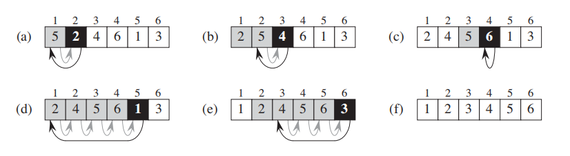
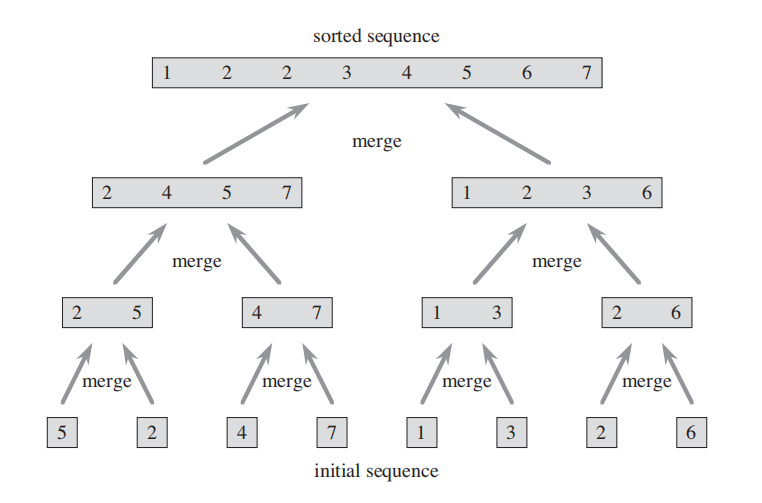

# 1、The Role of Algorithms in Computing

## 1.1、Algorithms

### 1.1-1

Give a real-world example that requires sorting or a real-world example that requires computing a convex hull.

—— 给出现实世界里需要进行排序或需要计算凸包的例子。

**答：**

排序：各个软件应用的热搜榜。

计算凸包：游戏中的碰撞检测。

---

### 1.1-2

Other than speed, what other measures of efficiency might one use in a real-world setting?

—— 除了速度，现实世界里还能用什么来衡量效率？

**答：**

存储效率、编码效率。

---

### 1.1-3

Select a data structure that you have seen previously, and discuss its strengths and limitations.

—— 选择一个你之前见过的数据结构，描述其优点和局限性。

**答：**

链表。

优点：在链表的任意位置新增或删除数据效率高，可随机存储。

局限性：定位链表中的某一数据需遍历链表，不可随机访问，链表中前继节点/后继节点的指针需占用额外的存储空间。

---

### 1.1-4

How are the shortest-path and traveling-salesman problems given above similar? How are they different?

—— 上面给出的最短路径问题和旅行商问题有哪些相似之处？又有哪些不同之处？

**答：**

相似之处：两个问题都是以最短距离求解路径。

不同之处：旅行商问题有更多的限制条件，即路径是一个回路，且路径经过所有的点。

---

### 1.1-5

Come up with a real-world problem in which only the best solution will do. Then come up with one in which a solution that is “approximately” the best is good enough.

—— 想出现实世界中一个只能精确求解的问题。再想出另一个可以近似求解的问题。

**答：**

只能精确求解：求两个正整数的最大公约数。

可以近似求解：求微分方程的解。

## 1.2、Algorithms as a technology

### 1.2-1

Give an example of an application that requires algorithmic content at the application level, and discuss the function of the algorithms involved.

—— 给出一个在应用程序级别需要算法内容的应用程序例子，并探讨其中用到的算法方法。

**答：**

地图导航。

寻路算法，搜索算法，排序算法。

---

### 1.2-2

Suppose we are comparing implementations of insertion sort and merge sort on the same machine. For inputs of size $n$, insertion sort runs in $8n^2 $ steps, while merge sort runs in $64n\lg n$ steps. For which values of $n$ does insertion sort beat merge sort?

—— 假设我们比较插入排序和归并排序在同一台机器上的运行情况，对于长度为 $n$ 的输入，插入排序需要运行 $8n^2$ 步，而归并排序需要运行 $64n\lg n$ 步，那么 $n$ 为多少时插入排序的效率比归并排序高？

**答：**

$n\leq43$
$$
8n^2<64n\lg n\\
n<8\lg n\\
n\leq43\quad(n\in N^*)
$$

---

### 1.2-3

What is the smallest value of $n$ such that an algorithm whose running time is $100n^2$ runs faster than an algorithm whose running time is $2^n$ on the same machine?

—— $n$ 最小为多少时使得在同一台机器上，运行时间为 $100n^2$ 的算法比运行时间为 $2^n$ 的算法要快？

**答：**

$n$ 最小为 $15$
$$
100n^2<2^n\\
n\geq 15\quad(n\in N^*)
$$

## Problems

### 1-1、Comparison of running times

For each function $f(n)$ and time $t$ in the following table, determine the largest size $n$ of a problem that can be solved in time $t$, assuming that the algorithm to solve the problem takes $f(n)$ microseconds.

—— 对于下表中的每一个函数 $f(n)$ 和时间 $t$，计算在时间 $t$ 内能够解决的问题的最大大小 $n$，假定解决问题用的算法用时 $f(n)$ 微妙。

**答：**

|           |       1 second       |      1 minute      |        1 hour        |          1 day           |          1 month          |           1 year           |         1 century          |
| :-------: | :------------------: | :----------------: | :------------------: | :----------------------: | :-----------------------: | :------------------------: | :------------------------: |
|  $\lg n$  |     $2^{1*10^6}$     |    $2^{6*10^7}$    |    $2^{3.6*10^9}$    |    $2^{8.64*10^{10}}$    |    $2^{2.592*10^{12}}$    |    $2^{9.4608*10^{14}}$    |    $2^{9.4608*10^{16}}$    |
| $\sqrt n$ |     $(1*10^6)^2$     |    $(6*10^7)^2$    |    $(3.6*10^9)^2$    |    $(8.64*10^{10})^2$    |    $(2.592*10^{12})^2$    |    $(9.4608*10^{14})^2$    |    $(9.4608*10^{16})^2$    |
|    $n$    |       $1*10^6$       |      $6*10^7$      |      $3.6*10^9$      |      $8.64*10^{10}$      |      $2.592*10^{12}$      |      $9.4608*10^{14}$      |      $9.4608*10^{16}$      |
| $n\lg n$  | 求解 $n\lg n=1*10^6$ |                    |                      |                          |                           |                            |                            |
|   $n^2$   |   $\sqrt{1*10^6}$    |  $\sqrt{6*10^7}$   |  $\sqrt{3.6*10^9}$   |  $\sqrt{8.64*10^{10}}$   |  $\sqrt{2.592*10^{12}}$   |  $\sqrt{9.4608*10^{14}}$   |  $\sqrt{9.4608*10^{16}}$   |
|   $n^3$   |  $\sqrt[3]{1*10^6}$  | $\sqrt[3]{6*10^7}$ | $\sqrt[3]{3.6*10^9}$ | $\sqrt[3]{8.64*10^{10}}$ | $\sqrt[3]{2.592*10^{12}}$ | $\sqrt[3]{9.4608*10^{14}}$ | $\sqrt[3]{9.4608*10^{16}}$ |
|   $2^n$   |    $\lg(1*10^6)$     |   $\lg(6*10^7)$    |   $\lg(3.6*10^9)$    |   $\lg(8.64*10^{10})$    |   $\lg(2.592*10^{12})$    |   $\lg(9.4608*10^{14})$    |   $\lg(9.4608*10^{16})$    |
|   $n!$    |   求解 $n!=1*10^6$   |                    |                      |                          |                           |                            |                            |

（表格内空白处为第一列同理）

# 2、Getting Started

## 2.1、Insertion sort

### 2.1-1



Using Figure 2.2 as a model, illustrate the operation of INSERTION-SORT on the array $A=\langle 31,41,59,26,41,58\rangle$.

—— 以上图为例，画图展示数组 $A=\langle 31,41,59,26,41,58\rangle$ 的插入排序操作。

**答：**

（a）$A=\langle 31,41,59,26,41,58\rangle$ ：$41$ 位置不变

（b）$A=\langle 31,41,59,26,41,58\rangle$ ：$59$ 位置不变

（c）$A=\langle 26,31,41,59,41,58\rangle$ ：$31,41,59$ 均往后移一格，$26$ 移至第一格

（d）$A=\langle 26,31,41,41,59,58\rangle$ ：$59$ 往后移一格，$41$ 移至第四格

（e）$A=\langle 26,31,41,41,58,59\rangle$ ：$59$ 往后移一格，$58$ 移至第五格

---

### 2.1-2

Rewrite the INSERTION-SORT procedure to sort into nonincreasing instead of nondecreasing order.

—— 将非递减排序的插入排序伪代码改写为非递增排序。

**答：**

```java
INSERTION-SORT(A)
1	for j = 2 to A.length
2		key = A[j]
3		i = j - 1
4		while i > 0 and A[i] < key
5			A[i + 1] = A[i]
6			i = i - 1
7		A[i + 1] = key
```

---

### 2.1-3

Consider the **searching problem**:

**Input:** A sequence of $n$ numbers $A=\langle a_1,a_2,...,a_n\rangle$ and a value $\upsilon$.

**Output:** An index $i$ such that $\upsilon=A[i]$ or the special value $NIL$ if $\upsilon$ does not appear in $A$.

Write pseudocode for **linear search**, which scans through the sequence, looking for $\upsilon$. Using a loop invariant, prove that your algorithm is correct. Make sure that your loop invariant fulfills the three necessary properties.

—— 写下扫描序列搜寻 $\upsilon$ 值的**线性搜索**伪代码。利用循环不变式证明你的算法是正确的。确保你的循环不变式满足三条必要的性质。

**答：**

```java
LINEAR-SEARCH(A, v)
3	for j = 1 to A.length
4		if A[j] = v
5			return j
6   	j = j + 1
7	return NIL
```

循环不变式：

1、初始化：循环的第一次迭代前 $(j=1)$，子数组 $A[1...j-1]$ 为空，即未开始搜寻 $\upsilon$ 值。

2、保持：循环每次都会将 $j$ 迭代+1，由于子数组 $A[1...j-1]$ 内未找到 $\upsilon$ 值（如果找到便会跳出循环），那么只要判断 $A[j]$ 是否等于 $\upsilon$ 值便可知道子数组 $A[1...j]$ 内是否找到 $\upsilon$ 值。

3、终止：循环终止时，算法返回下标值或算法返回特殊值 $NIL$。若算法返回特殊值 $NIL$，即 $j=A.length+1$，表明此次遍历未找到 $\upsilon$ 值，此时返回特殊值 $NIL$。若算法未返回特殊值 $NIL$，表明此次遍历找到了 $\upsilon$ 的下标，此时返回 $\upsilon$ 的下标。由此可知算法是正确的。

---

### 2.1-4

Consider the problem of adding two $n$-bit binary integers, stored in two $n$-element arrays $A$ and $B$. The sum of the two integers should be stored in binary form in an $(n+1)$-element array $C$. State the problem formally and write pseudocode for adding the two integers.

—— 设想一个问题：将两个 $n$ 比特的二进制整数相加，两个整数存储在装有 $n$ 个元素的数组 $A$ 和 $B$ 中。两个整数的和应当以二进制的形式存储在装有 $(n+1)$ 个元素的数组 $C$ 中。写下两整数相加的伪代码。

**答：**

```java
ADDING-TWO-INTEGERS(A, B)
1    C = [1...A.length + 1]
2    j = A.length
3    bit = 0
4    sum = 0
5    while j >= 0
6        sum = A[j] + B[j] + bit
7        if sum >= 2
8            sum = sum - 2
9            bit = 1
10       C[j + 1] = sum
11      j = j - 1
12  C[j + 1] = bit
13  return C
```

## 2.2、Analyzing algorithms

### 2.2-1

Express the function $n^3/1000-100n^2-100n+3$ in terms of $\Theta$-notation.

—— 用符号 $\Theta$ 表示函数 $n^3/1000-100n^2-100n+3$。

**答：**

$\Theta(n^3)$

---

### 2.2-2

Consider sorting $n$ numbers stored in array $A$ by first finding the smallest element of $A$ and exchanging it with the element in $A[1]$. Then find the second smallest element of $A$, and exchange it with $A[2]$. Continue in this manner for the first $n-1$ elements of $A$. Write pseudocode for this algorithm, which is known as **selection sort**. What loop invariant does this algorithm maintain? Why does it need to run for only the first $n-1$ elements, rather than for all $n$ elements? Give the best-case and worst-case running times of selection sort in $\Theta$-notation.

—— 假定对储存在数组 $A$ 的 $n$ 个数字进行排序，首先找到数组 $A$ 中最小的元素并使其与元素 $A[1]$ 交换，然后找到数组 $A$ 中第二小的元素并使其与元素 $A[2]$ 交换，对数组 $A$ 中的前 $n-1$ 个元素重复此方法。该算法被称作**选择排序**，写下该算法的伪代码。该算法维持着怎样的循环不变式？为什么该算法只需处理前 $n-1$ 个元素而不必处理全部 $n$ 个元素？用符号 $\Theta$ 给出选择排序算法的最佳情况和最坏情况运行时间。

**答：**

```java
SELECTION-SORT(A)
1   for j = 1 to A.length - 1
2       min = j
3       for i = j + 1 to A.length
4           if A[i] < A[min]
5               min = i
6       temp = A[j]
7       A[j] = A[min]
8       A[min] = temp
```

循环不变式：

1、初始化：循环的第一次迭代前 $(j=1)$，子数组 $A[1...j-1]$ 为空，即未选择出一个数组 $A$ 中的最小元素，未开始排序。

2、保持：对于每次循环的迭代，子数组 $A[1...j-1]$ 为已排序好的状态，而内层循环选择出的子数组 $A[j...A.length]$ 中的最小值被交换至 $A[j]$ 处，该最小值比子数组 $A[1...j-1]$ 中的值都要大（子数组中的每个值均为前面每次迭代选出的最小值），因此此时子数组 $A[1...j]$ 也为排序好的状态。

3、终止：循环结束时 $(j=A.length)$，子数组 $A[1...j-1]$ 为排序好的状态，且子数组内的元素为数组 $A$ 中前 $n-1$ 小的元素，即 $A[j]$ 为数组 $A$ 中最大的元素，因此此时数组 $A$ 为排序好的状态。由此可知算法是正确的。

循环不变式的第三条解释了为何只需处理前 $n-1$ 个元素。

不论数组的排序程度如何，内层循环都要遍历整个数组来找到最小值，因此，最佳情况运行时间：$\Theta(n^2)$，最坏情况运行时间：$\Theta(n^2)$

---

### 2.2-3

Consider linear search again (see Exercise 2.1-3). How many elements of the input sequence need to be checked on the average, assuming that the element being searched for is equally likely to be any element in the array? How about in the worst case? What are the average-case and worst-case running times of linear search in $\Theta$-notation? Justify your answers.

—— 再次考虑线性搜索算法（见练习2.1-3）。假设数组中任意一个元素被搜索的概率都相等，那么输入序列中平均有多少个元素需要被检查？最坏的情况又会如何？线性搜索的平均情况和最坏情况的运行时间用符号 $\Theta$ 表示是多少？证明你的答案。

**答：**

要搜索的元素在数组中各个位置所需的搜索次数为（未找到与处于最后一个位置的搜索次数相同）：$1,2,3,...,n$

那么平均检查的元素数量为：$(1+2+3+...+n)/n=(n+1)/2$

最坏的情况需要搜索 $n$ 个元素。

由于线性搜索执行的步骤数为：$N*C_1+C_2$ （$C_1、C_2$ 为常数，$N$ 为搜索的元素数）

因此平均情况运行时间：$\Theta(n)$，最坏情况运行时间：$\Theta(n)$

---

### 2.2-4

How can we modify almost any algorithm to have a good best-case running time?

—— 对于任意一个算法我们应该如何修改使之能获得一个较好的最佳情况运行时间？

**答：**

我们可以在算法执行核心步骤前判断是否已经达到条件，如果达到了直接输出结果。

## 2.3、Designing algorithms

### 2.3-1



Using Figure 2.4 as a model, illustrate the operation of merge sort on the array $A=\langle 3,41,52,26,38,57,9,49\rangle$.

—— 以上图为例子，画图说明归并排序算法在数组 $A=\langle 3,41,52,26,38,57,9,49\rangle$ 上的操作步骤。

**答：**

$\langle 3\rangle$    $\langle 41\rangle$            $\langle 52\rangle$    $\langle 26\rangle$            $\langle 38\rangle$    $\langle 57\rangle$            $\langle 9\rangle$    $\langle 49\rangle$ 

​      $\Downarrow$                             $\Downarrow$                             $\Downarrow$                            $\Downarrow$ 

  $\langle 3,41\rangle$                  $\langle 26,52\rangle$                  $\langle 38,57\rangle$                 $\langle 9,49\rangle$ 

​                     $\Downarrow$                                                              $\Downarrow$ 

​           $\langle 3,26,41,52\rangle$                                        $\langle 9,38,49,57\rangle$ 

​                                                        $\Downarrow$ 

​                                 $\langle 3,9,26,38,41,49,52,57\rangle$ 

---

### 2.3-2

Rewrite the MERGE procedure so that it does not use sentinels, instead stopping once either array $L$ or $R$ has had all its elements copied back to $A$ and then copying the remainder of the other array back into $A$.

—— 重写归并方法的代码使其不用无穷大符号，而是当数组 $L$ 或 $R$ 中任意一个将全部元素复制进数组 $A$ 时停止，并将另一个数组的剩余元素复制进数组 $A$ 中。

**答：**

```java
MERGE(A, p, q, r)
1   n1 = q - p + 1
2   n2 = r - q
3   let L[1...n1] and R[1...n2] be new arrays
4   for i = 1 to n1
5       L[i] = A[p + i - 1]
6   for j = 1 to n2
7       R[j] = A[q + j]
8   i = 1
9   j = 1
10  k = p
11  while k <= r and i <= n1 and j <= n2
12      if L[i] <= R[j]
13          A[k] = L[i]
14          i = i + 1
15      else
16          A[k] = R[j]
17          j = j + 1
18      k = k + 1
19  while k <= r and i <= n1
20      A[k] = L[i]
21      k = k + 1
22      i = i + 1
23  while k <= r and j <= n2
24      A[k] = R[j]
25      k = k + 1
26      j = j + 1
```

---

