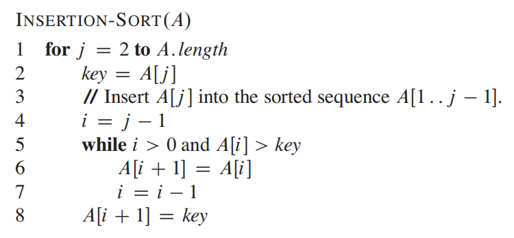
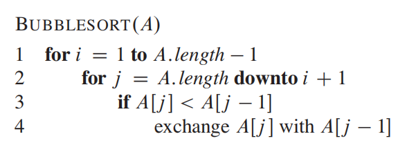
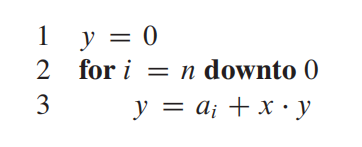

# 1、The Role of Algorithms in Computing

## 1.1、Algorithms

### 1.1-1

Give a real-world example that requires sorting or a real-world example that requires computing a convex hull.

—— 给出现实世界里需要进行排序或需要计算凸包的例子。

**答：**

排序：各个软件应用的热搜榜。

计算凸包：游戏中的碰撞检测。

---

### 1.1-2

Other than speed, what other measures of efficiency might one use in a real-world setting?

—— 除了速度，现实世界里还能用什么来衡量效率？

**答：**

存储效率、编码效率。

---

### 1.1-3

Select a data structure that you have seen previously, and discuss its strengths and limitations.

—— 选择一个你之前见过的数据结构，描述其优点和局限性。

**答：**

链表。

优点：在链表的任意位置新增或删除数据效率高，可随机存储。

局限性：定位链表中的某一数据需遍历链表，不可随机访问，链表中前继节点/后继节点的指针需占用额外的存储空间。

---

### 1.1-4

How are the shortest-path and traveling-salesman problems given above similar? How are they different?

—— 上面给出的最短路径问题和旅行商问题有哪些相似之处？又有哪些不同之处？

**答：**

相似之处：两个问题都是以最短距离求解路径。

不同之处：旅行商问题有更多的限制条件，即路径是一个回路，且路径经过所有的点。

---

### 1.1-5

Come up with a real-world problem in which only the best solution will do. Then come up with one in which a solution that is “approximately” the best is good enough.

—— 想出现实世界中一个只能精确求解的问题。再想出另一个可以近似求解的问题。

**答：**

只能精确求解：求两个正整数的最大公约数。

可以近似求解：求微分方程的解。

## 1.2、Algorithms as a technology

### 1.2-1

Give an example of an application that requires algorithmic content at the application level, and discuss the function of the algorithms involved.

—— 给出一个在应用程序级别需要算法内容的应用程序例子，并探讨其中用到的算法方法。

**答：**

地图导航。

寻路算法，搜索算法，排序算法。

---

### 1.2-2

Suppose we are comparing implementations of insertion sort and merge sort on the same machine. For inputs of size $n$, insertion sort runs in $8n^2 $ steps, while merge sort runs in $64n\lg n$ steps. For which values of $n$ does insertion sort beat merge sort?

—— 假设我们比较插入排序和归并排序在同一台机器上的运行情况，对于长度为 $n$ 的输入，插入排序需要运行 $8n^2$ 步，而归并排序需要运行 $64n\lg n$ 步，那么 $n$ 为多少时插入排序的效率比归并排序高？

**答：**

$n\leq43$
$$
8n^2<64n\lg n\\
n<8\lg n\\
n\leq43\quad(n\in N^*)
$$

---

### 1.2-3

What is the smallest value of $n$ such that an algorithm whose running time is $100n^2$ runs faster than an algorithm whose running time is $2^n$ on the same machine?

—— $n$ 最小为多少时使得在同一台机器上，运行时间为 $100n^2$ 的算法比运行时间为 $2^n$ 的算法要快？

**答：**

$n$ 最小为 $15$
$$
100n^2<2^n\\
n\geq 15\quad(n\in N^*)
$$

## Problems

### 1-1、Comparison of running times

For each function $f(n)$ and time $t$ in the following table, determine the largest size $n$ of a problem that can be solved in time $t$, assuming that the algorithm to solve the problem takes $f(n)$ microseconds.

—— 对于下表中的每一个函数 $f(n)$ 和时间 $t$，计算在时间 $t$ 内能够解决的问题的最大大小 $n$，假定解决问题用的算法用时 $f(n)$ 微妙。

**答：**

|           |       1 second       |      1 minute      |        1 hour        |          1 day           |          1 month          |           1 year           |         1 century          |
| :-------: | :------------------: | :----------------: | :------------------: | :----------------------: | :-----------------------: | :------------------------: | :------------------------: |
|  $\lg n$  |     $2^{1*10^6}$     |    $2^{6*10^7}$    |    $2^{3.6*10^9}$    |    $2^{8.64*10^{10}}$    |    $2^{2.592*10^{12}}$    |    $2^{9.4608*10^{14}}$    |    $2^{9.4608*10^{16}}$    |
| $\sqrt n$ |     $(1*10^6)^2$     |    $(6*10^7)^2$    |    $(3.6*10^9)^2$    |    $(8.64*10^{10})^2$    |    $(2.592*10^{12})^2$    |    $(9.4608*10^{14})^2$    |    $(9.4608*10^{16})^2$    |
|    $n$    |       $1*10^6$       |      $6*10^7$      |      $3.6*10^9$      |      $8.64*10^{10}$      |      $2.592*10^{12}$      |      $9.4608*10^{14}$      |      $9.4608*10^{16}$      |
| $n\lg n$  | 求解 $n\lg n=1*10^6$ |                    |                      |                          |                           |                            |                            |
|   $n^2$   |   $\sqrt{1*10^6}$    |  $\sqrt{6*10^7}$   |  $\sqrt{3.6*10^9}$   |  $\sqrt{8.64*10^{10}}$   |  $\sqrt{2.592*10^{12}}$   |  $\sqrt{9.4608*10^{14}}$   |  $\sqrt{9.4608*10^{16}}$   |
|   $n^3$   |  $\sqrt[3]{1*10^6}$  | $\sqrt[3]{6*10^7}$ | $\sqrt[3]{3.6*10^9}$ | $\sqrt[3]{8.64*10^{10}}$ | $\sqrt[3]{2.592*10^{12}}$ | $\sqrt[3]{9.4608*10^{14}}$ | $\sqrt[3]{9.4608*10^{16}}$ |
|   $2^n$   |    $\lg(1*10^6)$     |   $\lg(6*10^7)$    |   $\lg(3.6*10^9)$    |   $\lg(8.64*10^{10})$    |   $\lg(2.592*10^{12})$    |   $\lg(9.4608*10^{14})$    |   $\lg(9.4608*10^{16})$    |
|   $n!$    |   求解 $n!=1*10^6$   |                    |                      |                          |                           |                            |                            |

（表格内空白处为第一列同理）

# 2、Getting Started

## 2.1、Insertion sort

### 2.1-1


Using Figure 2.2 as a model, illustrate the operation of INSERTION-SORT on the array $A=\langle 31,41,59,26,41,58\rangle$.

—— 以上图为例，画图展示数组 $A=\langle 31,41,59,26,41,58\rangle$ 的插入排序操作。

**答：**

（a）$A=\langle 31,41,59,26,41,58\rangle$ ：$41$ 位置不变

（b）$A=\langle 31,41,59,26,41,58\rangle$ ：$59$ 位置不变

（c）$A=\langle 26,31,41,59,41,58\rangle$ ：$31,41,59$ 均往后移一格，$26$ 移至第一格

（d）$A=\langle 26,31,41,41,59,58\rangle$ ：$59$ 往后移一格，$41$ 移至第四格

（e）$A=\langle 26,31,41,41,58,59\rangle$ ：$59$ 往后移一格，$58$ 移至第五格

---

### 2.1-2

Rewrite the INSERTION-SORT procedure to sort into nonincreasing instead of nondecreasing order.

—— 将非递减排序的插入排序伪代码改写为非递增排序。

**答：**

```java
INSERTION-SORT(A)
1	for j = 2 to A.length
2		key = A[j]
3		i = j - 1
4		while i > 0 and A[i] < key
5			A[i + 1] = A[i]
6			i = i - 1
7		A[i + 1] = key
```

---

### 2.1-3

Consider the **searching problem**:

**Input:** A sequence of $n$ numbers $A=\langle a_1,a_2,...,a_n\rangle$ and a value $v$.

**Output:** An index $i$ such that $v=A[i]$ or the special value $NIL$ if $v$ does not appear in $A$.

Write pseudocode for **linear search**, which scans through the sequence, looking for $v$. Using a loop invariant, prove that your algorithm is correct. Make sure that your loop invariant fulfills the three necessary properties.

—— 写下扫描序列搜寻 $v$ 值的**线性搜索**伪代码。利用循环不变式证明你的算法是正确的。确保你的循环不变式满足三条必要的性质。

**答：**

```java
LINEAR-SEARCH(A, v)
3	for j = 1 to A.length
4		if A[j] = v
5			return j
6   	j = j + 1
7	return NIL
```

循环不变式：循环的每次迭代前，子数组 $A[1 ...j-1]$ 内为已检查过的全部元素。

1、初始化：循环的第一次迭代前， $j=1$，子数组 $A[1 ...j-1]$ 为空，即还未检查过元素。循环不变式成立。

2、保持：假设在某次迭代前，循环不变式成立，此时 $j=k$。由循环不变式可知，$A[k]$ 为此次迭代要检查的元素，$A[i...k-1]$ 内为已检查过的全部元素。执行此次迭代：若 $A[k]=v$，则第4行判断式为真，程序返回下标 $k$，循环终止。若 $A[k]!=v$，则第4行判断式为假，$j$ 的值加一，迭代结束，元素 $A[k]$ 经过检查，易知子数组 $A[1 ...k]$ 内为已检查过的全部元素。所以下次迭代的循环不变式成立。

3、终止：循环终止时，由**保持**可知一种终止的情况为程序找到了 $v$ 值并返回了下标，假设返回的下标值为 $k$，则子数组 $A[1 ...k]$ 内为已检查过的全部元素；而对于另一种终止的情况，循环遍历完了整个序列，$j=A.length+1$，此时子数组 $A[1 ...A.length]$ 即为整个数组，整个数组检查完了没找到 $v$ 值，程序返回特殊值 $NIL$。综合可知循环不变式成立，且由上述分析的程序返回值可知算法正确。

---

### 2.1-4

Consider the problem of adding two $n$-bit binary integers, stored in two $n$-element arrays $A$ and $B$. The sum of the two integers should be stored in binary form in an $(n+1)$-element array $C$. State the problem formally and write pseudocode for adding the two integers.

—— 设想一个问题：将两个 $n$ 比特的二进制整数相加，两个整数存储在装有 $n$ 个元素的数组 $A$ 和 $B$ 中。两个整数的和应当以二进制的形式存储在装有 $(n+1)$ 个元素的数组 $C$ 中。写下两整数相加的伪代码。

**答：**

```java
ADDING-TWO-INTEGERS(A, B)
1    C = [1...A.length + 1]
2    j = A.length
3    bit = 0
4    sum = 0
5    while j >= 0
6        sum = A[j] + B[j] + bit
7        if sum >= 2
8            sum = sum - 2
9            bit = 1
10       C[j + 1] = sum
11      j = j - 1
12  C[j + 1] = bit
13  return C
```

## 2.2、Analyzing algorithms

### 2.2-1

Express the function $n^3/1000-100n^2-100n+3$ in terms of $\Theta$-notation.

—— 用符号 $\Theta$ 表示函数 $n^3/1000-100n^2-100n+3$。

**答：**

$\Theta(n^3)$

---

### 2.2-2

Consider sorting $n$ numbers stored in array $A$ by first finding the smallest element of $A$ and exchanging it with the element in $A[1]$. Then find the second smallest element of $A$, and exchange it with $A[2]$. Continue in this manner for the first $n-1$ elements of $A$. Write pseudocode for this algorithm, which is known as **selection sort**. What loop invariant does this algorithm maintain? Why does it need to run for only the first $n-1$ elements, rather than for all $n$ elements? Give the best-case and worst-case running times of selection sort in $\Theta$-notation.

—— 假定对储存在数组 $A$ 的 $n$ 个数字进行排序，首先找到数组 $A$ 中最小的元素并使其与元素 $A[1]$ 交换，然后找到数组 $A$ 中第二小的元素并使其与元素 $A[2]$ 交换，对数组 $A$ 中的前 $n-1$ 个元素重复此方法。该算法被称作**选择排序**，写下该算法的伪代码。该算法维持着怎样的循环不变式？为什么该算法只需处理前 $n-1$ 个元素而不必处理全部 $n$ 个元素？用符号 $\Theta$ 给出选择排序算法的最佳情况和最坏情况运行时间。

**答：**

```java
SELECTION-SORT(A)
1   for j = 1 to A.length - 1
2       min = j
3       for i = j + 1 to A.length
4           if A[i] < A[min]
5               min = i
6       temp = A[j]
7       A[j] = A[min]
8       A[min] = temp
```

设 $n=A.length$

循环不变式：对于1-8行的循环，在循环的每次迭代前，子数组 $A[1 ...j-1]$ 为已排序好的数组，且保存着 $A[1 ...n]$ 中最小的 $j-1$ 个数。

1、初始化：在第一次迭代前， $j=1$，子数组 $A[1 ...j-1]$ 为空。可约定空数组比任意非空数组的元素都要小，由此得循环不变式成立。

2、保持：假设在某次迭代前，循环不变式成立，此时 $j=k$。根据循环不变式，子数组 $A[1 ...k-1]$ 为已排序好的数组，且保存着 $A[1 ...n]$ 中最小的 $k-1$ 个数。执行此次迭代：2-4行找出了子数组 $A[k...n]$ 中最小的元素，设最小元素为 $min$，易知 $min$ 比 $A[1 ...k-1]$ 中任意一个元素都要大。6-8行将 $min$ 与 $A[k]$ 交换了位置，因为子数组 $A[1 ...k-1]$ 已经递增排列完毕，所以此时子数组 $A[1 ...k]$ 为已排序好的数组（递增排列），且保存着 $A[1 ...n]$ 中最小的 $k$ 个数。所以下次迭代的循环不变式成立。

3、终止：当迭代终止时，$j=n$，由**保持**的分析可知子数组 $A[1 ...n-1]$ 为已排序好的数组，$A[n]$ 比 $A[1 ...n-1]$ 中任意一个元素都要大，显然此时 $A[1 ...n]=A$ 为已排序好的数组，数组排序完毕。由此可知循环不变式成立，且算法是正确的。

循环不变式的**终止**解释了为何只需处理前 $n-1$ 个元素。

不论数组的排序程度如何，内层循环都要遍历整个数组来找到最小值，因此，最佳情况运行时间：$\Theta(n^2)$，最坏情况运行时间：$\Theta(n^2)$

---

### 2.2-3

Consider linear search again (see Exercise 2.1-3). How many elements of the input sequence need to be checked on the average, assuming that the element being searched for is equally likely to be any element in the array? How about in the worst case? What are the average-case and worst-case running times of linear search in $\Theta$-notation? Justify your answers.

—— 再次考虑线性搜索算法（见练习2.1-3）。假设数组中任意一个元素被搜索的概率都相等，那么输入序列中平均有多少个元素需要被检查？最坏的情况又会如何？线性搜索的平均情况和最坏情况的运行时间用符号 $\Theta$ 表示是多少？证明你的答案。

**答：**

要搜索的元素在数组中各个位置所需的搜索次数为（未找到与处于最后一个位置的搜索次数相同）：$1,2,3,...,n$

那么平均检查的元素数量为：$(1+2+3+...+n)/n=(n+1)/2$

最坏的情况需要搜索 $n$ 个元素。

由于线性搜索执行的步骤数为：$N*C_1+C_2$ （$C_1、C_2$ 为常数，$N$ 为搜索的元素数）

因此平均情况运行时间：$\Theta(n)$，最坏情况运行时间：$\Theta(n)$

---

### 2.2-4

How can we modify almost any algorithm to have a good best-case running time?

—— 对于任意一个算法我们应该如何修改使之能获得一个较好的最佳情况运行时间？

**答：**

我们可以在算法执行核心步骤前判断是否已经达到条件，如果达到了直接输出结果。

## 2.3、Designing algorithms

### 2.3-1


Using Figure 2.4 as a model, illustrate the operation of merge sort on the array $A=\langle 3,41,52,26,38,57,9,49\rangle$.

—— 以上图为例子，画图说明归并排序算法在数组 $A=\langle 3,41,52,26,38,57,9,49\rangle$ 上的操作步骤。

**答：**

$\langle 3\rangle$    $\langle 41\rangle$            $\langle 52\rangle$    $\langle 26\rangle$            $\langle 38\rangle$    $\langle 57\rangle$            $\langle 9\rangle$    $\langle 49\rangle$ 

​      $\Downarrow$                             $\Downarrow$                             $\Downarrow$                            $\Downarrow$ 

  $\langle 3,41\rangle$                  $\langle 26,52\rangle$                  $\langle 38,57\rangle$                 $\langle 9,49\rangle$ 

​                     $\Downarrow$                                                              $\Downarrow$ 

​           $\langle 3,26,41,52\rangle$                                        $\langle 9,38,49,57\rangle$ 

​                                                        $\Downarrow$ 

​                                 $\langle 3,9,26,38,41,49,52,57\rangle$ 

---

### 2.3-2

Rewrite the MERGE procedure so that it does not use sentinels, instead stopping once either array $L$ or $R$ has had all its elements copied back to $A$ and then copying the remainder of the other array back into $A$.

—— 重写归并方法的代码使其不用无穷大符号，而是当数组 $L$ 或 $R$ 中任意一个将全部元素复制进数组 $A$ 时停止，并将另一个数组的剩余元素复制进数组 $A$ 中。

**答：**

```java
MERGE(A, p, q, r)
1   n1 = q - p + 1
2   n2 = r - q
3   let L[1...n1] and R[1...n2] be new arrays
4   for i = 1 to n1
5       L[i] = A[p + i - 1]
6   for j = 1 to n2
7       R[j] = A[q + j]
8   i = 1
9   j = 1
10  k = p
11  while k <= r and i <= n1 and j <= n2
12      if L[i] <= R[j]
13          A[k] = L[i]
14          i = i + 1
15      else
16          A[k] = R[j]
17          j = j + 1
18      k = k + 1
19  while k <= r and i <= n1
20      A[k] = L[i]
21      k = k + 1
22      i = i + 1
23  while k <= r and j <= n2
24      A[k] = R[j]
25      k = k + 1
26      j = j + 1
```

---

### 2.3-3

Use mathematical induction to show that when $n$ is an exact power of $2$, the solution of the recurrence is $T(n)=n\lg n$.
$$
T(n)=\left\{
\begin{array}{l}
2 & if\ n = 2,\\
2T(n/2)+n & if\ n=2^k,\ for\ k>1
\end{array}
\right.
$$
—— 用数学归纳法证明，当 $n$ 为 $2$ 的精确幂时，上述递归式的表达式为 $T(n)=n\lg n$。

**答：**

（1）当 $k=1$ 即 $n=2$ 时，$T(2)=2*\lg 2=2$ ，表达式成立。

（2）当 $k>1$ 时，假设 $k=i$ 时表达式成立，即 $T(n)=T(2^i)=2^i\lg 2^i=i2^i$。

​		  那么当 $k=i+1$ 时，$T(n)=T(2^{i+1})=2T(2^{i+1}/2)+2^{i+1}=2T(2^i)+2^{i+1}=2i2^i+2^{i+1}=(i+1)2^{i+1}=n\lg n$，表达式成立。

（3）综合（1）、（2）可得，上述递归式的表达式为 $T(n)=n\lg n$。

---

### 2.3-4

We can express insertion sort as a recursive procedure as follows. In order to sort $A[1...n]$, we recursively sort $A[1...n-1]$ and then insert $A[n]$ into the sorted array $A[1...n-1]$. Write a recurrence for the running time of this recursive version of insertion sort.

—— 我们可以将插入排序算法表达为下述的递归程序。为了给数组 $A[1...n]$ 排序，我们递归地给数组 $A[1...n-1]$ 排序，然后将 $A[n]$ 插入到排序好的数组 $A[1...n-1]$ 内。为插入排序的递归版本写一个递归程序。

**答：**

```java
INSERTION-SORT-RECURRENCE(A, n)
1   if n <= 0
2       return
3   INSERTION-SORT-RECURRENCE(A, n - 1)
4   temp = A[n]
5   i = n - 1
6   while i >= 1 and A[i] > temp
7       A[i + 1] = A[i]
8       i = i - 1
9   A[i + 1] = temp
```

---

### 2.3-5

Referring back to the searching problem (see Exercise 2.1-3), observe that if the sequence $A$ is sorted, we can check the midpoint of the sequence against $v$ and eliminate half of the sequence from further consideration. The **binary search** algorithm repeats this procedure, halving the size of the remaining portion of the sequence each time. Write pseudocode, either iterative or recursive, for binary search. Argue that the worst-case running time of binary search is $\Theta(\lg n)$.

—— 回顾之前的搜索问题（见练习2.1-3）。考虑到如果序列A是排序好的，我们可以将序列的中点与 $v$ 值进行比较，并进一步排除掉序列的一半。**二分查找**算法就是不断重复这步操作，每次将序列的剩余部分减半。写下该算法的伪代码，迭代的方法和递归的方法均可。证明二分查找算法的最坏情况运行时间为 $\Theta(\lg n)$。

**答：**

```java
BINARY-SEARCH(A, v, p, r)
1   if p > r
2       return NIL
3   q = FLOOR((p + r) / 2)
4   if A[q] = v
5       return q
6   else if A[q] < v
7       BINARY-SEARCH(A, v, q + 1, r)
8   else
9       BINARY-SEARCH(A, v, p, q)
```

假要找的 $v$ 值不在数组 $A$ 中，则该算法需要二分 $\lg n$ 次，因此二分查找算法的最坏情况运行时间为 $\Theta(\lg n)$。

---

### 2.3-6

Observe that the **while** loop of lines 5–7 of the INSERTION-SORT procedure in Section 2.1 uses a linear search to scan (backward) through the sorted subarray $A[1...j-1]$. Can we use a binary search (see Exercise 2.3-5) instead to improve the overall worst-case running time of insertion sort to $\Theta(n\lg n)$?



—— 注意到章节2.1里插入排序代码的5-7行的 **while** 循环内使用了线性搜索来（向后）遍历已排序好的子数组 $A[1...j-1]$。我们能否用二分查找法（见练习2.3-5）作为代替来将插入排序的最坏情况运行时间改进到 $\Theta(n\lg n)$？

**答：**

不能。因为二分查找法只是对查找的效率进行了改进，而原代码里除了查找还对数组的对应项进行了移项，这部分的时间不可避免。

---

### 2.3-7

Describe a $\Theta(n\lg n)$-time algorithm that, given a set $S$ of $n$ integers and another integer $x$, determines whether or not there exist two elements in $S$ whose sum is exactly $x$.

—— 描述一个算法，其时间复杂度为 $\Theta(n\lg n)$：给定一个有 $n$ 个整数的集合 $S$ 以及另一个整数 $x$，判断 $S$ 内是否存在两个元素，其相加之和等于 $x$。

**答：**

```java
SEARCH-SUM(S, x)
1   MERGE-SORT(S)
2   for i = 1 to S.length
3       v = x - S[i]
4       index = BINARY-SEARCH(S, v, 1, S.length)
5       if index != NIL and index != i
6           return true
7   return false
```

先用归并排序对集合 $S$ 进行排序，然后遍历集合 $S$，对每一项元素 $S[i]$ 取 $x-S[i]$ 的差值 $v$，在集合 $S$ 内对 $v$ 进行二分查找，如果查找到了对应元素且该元素不为 $S[i]$，则存在。如果遍历完集合 $S$ 也没有找到，则不存在。

归并排序用时 $\Theta(n\lg n)$，二分查找用时 $\Theta(\lg n)$，而最坏情况要遍历 $n$ 次，因此遍历的最坏情况用时 $\Theta(n\lg n)$，因此该算法的时间复杂度为 $\Theta(n\lg n)$。

## Problems

### 2-1、Insertion sort on small arrays in merge sort

Although merge sort runs in $\Theta(n\lg n)$ worst-case time and insertion sort runs in $\Theta(n^2)$ worst-case time, the constant factors in insertion sort can make it faster in practice for small problem sizes on many machines. Thus, it makes sense to **coarsen** the leaves of the recursion by using insertion sort within merge sort when subproblems become sufficiently small. Consider a modification to merge sort in which $n/k$ sublists of length $k$ are sorted using insertion sort and then merged using the standard merging mechanism, where $k$ is a value to be determined.

**a.**  Show that insertion sort can sort the $n/k$ sublists, each of length $k$, in $\Theta(nk)$ worst-case time.

**b.**  Show how to merge the sublists in $\Theta(n\lg(n/k))$ worst-case time.

**c.**  Given that the modified algorithm runs in $\Theta(nk+n\lg(n/k))$ worst-case time, what is the largest value of $k$ as a function of $n$ for which the modified algorithm has the same running time as standard merge sort, in terms of $\Theta$-notation?

**d.**  How should we choose $k$ in practice?

—— 尽管归并排序的最坏情况运行时间为 $\Theta(n\lg n)$，插入排序的最坏情况运行时间为 $\Theta(n^2)$，但实际上在许多机器上，插入排序的常量因素能使其运行的更快。因此，当归并排序的子问题足够小时，有必要通过将插入排序融合进归并排序来协调递归树的叶子情况。考虑归并排序的一个修改：长度为 $k$ 的 $n/k$ 个子列表用插入排序进行排序，然后用标准的合并机制将其合并，其中 $k$ 是一个待定的值。

**a.**  证明插入排序可以在 $\Theta(nk)$ 的最坏情况运行时间内排序长度为 $k$ 的 $n/k$ 个子列表。

**b.**  证明合并这些子列表的最坏情况运行时间为 $\Theta(n\lg(n/k))$ 。

**c.**  如果已知修改后的算法的最坏情况运行时间为 $\Theta(nk+n\lg(n/k))$ ，$k$ 的最大渐近值（即 $\Theta$ 的形式）为多少时能使修改后的算法运行时间与标准归并排序算法相同？以n的函数形式表示。

**d.**  在实践中我们应如何选取 $k$ 的值？

**答：**

**a：** 插入排序的最坏情况运行时间为 $\Theta(n^2)$，因此排序长度为 $k$ 的子列表的最坏情况运行时间为 $\Theta(k^2)$，排序 $n/k$ 个 $k$ 长度的子列表的最坏情况运行时间为 $(n/k)*\Theta(k^2)=\Theta(nk)$。

**b：** 由归并排序的递归树可知每一层合并的规模均为 $n$，而该递归树有 $\lg(n/k)$ 层，即 $n/k$ 个子列表需要合并 $\lg(n/k)$ 次，因此合并这些子列表的最坏情况运行时间为 $\Theta(n\lg(n/k))$。

**c：** $\Theta(nk+n\lg(n/k))=\Theta(nk+n\lg n-n\lg k)$，因为 $k$ 一定比 $n$ 小，所以 $n\lg k$ 的阶数比 $n\lg n$ 小，所以 $\Theta(nk+n\lg n-n\lg k)=\Theta(nk+n\lg n)$。要使得修改后算法的运行时间与标准归并排序相同，必须 $\Theta(nk+n\lg n)=\Theta(n\lg n)$，即 $nk$ 的阶数要比 $n\lg n$ 小，所以 $k\leq\lg n$，所以 $k$ 的最大渐进值为 $\Theta(\lg n)$。

**b：** 由 **c** 可知实践中，$k$ 应取 $\lfloor\lg n\rfloor$。

---

### 2-2、Correctness of bubblesort



Bubblesort is a popular, but inefficient, sorting algorithm. It works by repeatedly swapping adjacent elements that are out of order.

**a.**  Let $A'$ denote the output of BUBBLESORT$(A)$. To prove that BUBBLESORT is correct, we need to prove that it terminates and that
$$
\begin{equation}
A'[1]\leq A'[2]\leq ...\leq A'[n],\tag{2.3}
\end{equation}
$$
where $n=A.length$. In order to show that BUBBLESORT actually sorts, what else do we need to prove?

The next two parts will prove inequality (2.3).

**b.**  State precisely a loop invariant for the **for** loop in lines 2–4, and prove that this loop invariant holds. Your proof should use the structure of the loop invariant proof presented in this chapter.

**c.**  Using the termination condition of the loop invariant proved in part (b), state a loop invariant for the **for** loop in lines 1–4 that will allow you to prove inequality (2.3). Your proof should use the structure of the loop invariant proof presented in this chapter.

**d.** What is the worst-case running time of bubblesort? How does it compare to the running time of insertion sort?

—— 冒泡排序算法是一个流行的、但不那么效率的算法，它通过重复交换相邻的两个反序元素来排序。

**a.**  设 $A'$ 为 BUBBLESORT$(A)$ 的输出，为了证明 BUBBLESORT 是正确的，我们需要证明它能够终止，并且满足（2.3）不等式，其中 $n=A.length$。为了证明 BUBBLESORT 确实能实现排序效果，我们还需要证明什么？

**b.**  对于2-4行的 **for** 循环，给出一个准确的循环不变式，并证明这个循环不变式是成立的。证明应采用本章中给出的循环不变式证明结构。

**c.**  利用 **b** 中证明的循环不变式的终止条件，对于1-4行的 **for** 循环给出一个循环不变式，它可以用来证明（2.3）不等式。证明应采用本章中给出的循环不变式证明结构。

**d.**  冒泡排序算法的最坏情况运行时间是多少？它与插入排序算法的运行时间相比较又如何？

**答：**

**a：** 我们还需要证明 $A'$ 是 $A$ 的一种排列。

**b：** 循环不变式：在循环的每次迭代前，$A[j]$ 为子数组 $A[j...n]$ 的最小元素，且 $A[j...n]$ 为原 $A[j...n]$ 的一个排列。

1、初始化：在第一次迭代前，$j=n$，$A[j...n]=A[n]$ 只有一个元素，显然 $A[n]$ 为子数组中的最小元素，并且为原子数组的一个排列。循环不变式成立。

2、保持：假设在某次迭代前，循环不变式成立，此时 $j=k$。根据循环不变式，$A[k]$ 为 $A[k...n]$ 中的最小元素，且 $A[k...n]$ 是原 $A[k...n]$ 的一个排列。执行此次迭代：若 $A[k]\geq A[k-1]$，则第3行判断式为假，此次迭代结束，易知 $A[k-1]$ 为 $A[k-1...n]$ 中的最小元素；$A[k-1...n]$ 未变，为原 $A[k-1...n]$ 的一个排列。若 $A[k]<A[k-1]$，则第3行判断式为真，执行第4行交换 $A[k-1]$ 和 $A[k]$ 的值，交换后 $A[k-1]<A[k]$，易知 $A[k-1]$ 为 $A[k-1...n]$ 中的最小元素；此次迭代只交换了两个元素的位置，因此 $A[k-1...n]$ 为原 $A[k-1...n]$ 的一个排列。所以下次迭代的循环不变式成立。

3、终止：当迭代终止时，$j=i$，由**保持**的分析可知 $A[i]$ 为 $A[i...n]$ 中的最小元素，且 $A[i...n]$ 为原 $A[i...n]$ 的一个排列。循环不变式成立。

**c：** 循环不变式：在循环的每次迭代前，子数组 $A[1 ...j-1]$ 为已排序好的数组，且保存着 $A[1 ...n]$ 中最小的 $j-1$ 个数。

1、初始化：在第一次迭代前，$j=1$，子数组 $A[1 ...j-1]$ 为空。可约定空数组比任意非空数组的元素都要小，由此得循环不变式成立。

2、保持：假设在某次迭代前，循环不变式成立，此时 $j=k$。根据循环不变式，子数组 $A[1 ...k-1]$ 为已排序好的数组，且保存着 $A[1 ...n]$ 中最小的 $k-1$ 个数。执行此迭代：由 **b** 可知执行完内层循环后 $A[k]$ 为 $A[k...n]$ 中的最小元素，易知 $A[k]$ 比 $A[1 ...k-1]$ 中任意一个元素都要大，所以此时子数组 $A[1 ...k]$ 为已排序好的数组，且保存着 $A[1 ...n]$ 中最小的 $k$ 个数。所以下次迭代的循环不变式成立。

3、终止：当迭代终止时，$j=n$，由**保持**的分析可知子数组 $A[1 ...n]$ 为已排序好的数组，且 $A[1 ...n]$ 包含了 $A[1 ...n]$ 中所有的元素。由此可知循环不变式成立，且算法是正确的。（2.3）不等式得以证明。

**d：** 冒泡排序算法的最坏情况运行时间为 $\Theta(\sum_{i=1}^n(n-i))=\Theta(n^2)$，与插入排序算法相同。

---

### 2-3、Correctness of Horner’s rule

The following code fragment implements Horner’s rule for evaluating a polynomial
$$
\begin{align}
P(x)&=\sum_{k=0}^na_kx^k\\
&=a_0+x(a_1+x(a_2+...+x(a_{n-1}+xa_n)...))\ ,
\end{align}\tag{2.4}
$$
given the coefficients $a_0,a_1,...,a_n$ and a value for $x$:



**a.**  In terms of $\Theta$-notation, what is the running time of this code fragment for Horner’s rule?

**b.**  Write pseudocode to implement the naive polynomial-evaluation algorithm that computes each term of the polynomial from scratch. What is the running time of this algorithm? How does it compare to Horner’s rule?

**c.**  Consider the following loop invariant:

​		At the start of each iteration of the **for** loop of lines 2–3,
$$
\begin{equation}
y=\sum_{k=0}^{n-(i+1)}a_{k+i+1}x^k
\end{equation}\tag{2.5}
$$
Interpret a summation with no terms as equaling 0. Following the structure of the loop invariant proof presented in this chapter, use this loop invariant to show that, at termination, $y=\sum_{k=0}^na_kx^k$.

**d.**  Conclude by arguing that the given code fragment correctly evaluates a polynomial characterized by the coefficients $a_0,a_1,...,a_n$.

—— 上图中的代码片段实现了用于计算（2.4）多项式的霍纳规则（给定系数 $a_0,a_1,...,a_n$ 和值 $x$）。

**a.**  这段实现了霍纳规则的代码片段的渐近运行时间是多少？

**b.**  写出实现朴素多项式求值算法的伪代码，它从头开始计算多项式的每一个项。这个算法的运行时间是多少？它与霍纳规则相比较如何？

**c.**  证明以下的循环不变式：

​		在2-3行的 **for** 循环的每次迭代开始，有等式（2.5），不包含任何项的和视为等于0。

证明应遵循本章给出的循环不变式证明结构，且在终止时，有 $y=\sum_{k=0}^na_kx^k$。

**d.**  证明图中给出的代码片段能正确计算由系数 $a_0,a_1,...,a_n$ 描述的多项式。

**答：**

**a：** 图中代码片段的渐近运行时间为 $\Theta(n)$。

**b：** 朴素多项式求职算法的伪代码如下：

```java
NAIVE-POLYNOMIAL-EVALUATION
1   y = 0
2   for j = 0 to n
3       t = 1
4       for i = 1 to j
5           t = t * x
6       y = y + aj * t
```

该算法的运行时间为 $\Theta(\sum_{i=0}^ni)=\Theta(n^2)$，比霍纳规则的运行时间要长。

**c：** 循环不变式：如 **c** 中所描述。

1、初始化：在第一次迭代前，$i=n$，$y=0$，$y=\sum_{k=0}^{n-(n+1)}a_{k+n+1}x^k=\sum_{k=0}^{-1}a_{k+n+1}x^k$ 为不包含任何项的求和，即视为0，等式（2.5）成立，所以循环不变式成立。

2、保持：假设在某次迭代前，循环不变式成立，此时 $i=j$。根据循环不变式，此时 $y=\sum_{k=0}^{n-(j+1)}a_{k+j+1}x^k$。执行此迭代：则
$$
\begin{align}
y&=a_j+x*y\\
&=a_j+x*\sum_{k=0}^{n-(j+1)}a_{k+j+1}x^k\\
&=a_j+x*(a_{j+1}x^0+a_{j+2}x^1+..+a_nx^{n-(j+1)})\\
&=a_jx^0+a_{j+1}x^1+a_{j+2}x^2+...+a_nx^{n-j}\\
&=\sum_{k=0}^{n-j}a_{k+j}x^k\\
&=\sum_{k=0}^{n-((j-1)+1)}a_{k+(j-1)+1}x^k
\end{align}
$$
可知，$i=j-1$ 时，等式（2.5）依然成立，所以下次迭代的循环不变式成立。

3、终止：当迭代终止时，$i=0$，由**保持**的分析可得 $y=\sum_{k=0}^{n-(-1+1)}a_{k+(-1)+1}x^k=\sum_{k=0}^na_kx^k$，循环不变式成立。

**d：** 由 **c** 的**终止**分析可知图中代码片段能正确计算多项式。

---

### 2-4、Inversions

Let $A[1 ...n]$ be an array of $n$ distinct numbers. If $i<j$ and $A[i]>A[j]$, then the pair $(i,j)$ is called an **inversion** of $A$.

**a.**  List the five inversions of the array $\langle 2,3,8,6,1\rangle$.

**b.**  What array with elements from the set $\{ 1,2,...,n\}$ has the most inversions? How many does it have?

**c.**  What is the relationship between the running time of insertion sort and the number of inversions in the input array? Justify your answer.

**d.**  Give an algorithm that determines the number of inversions in any permutation on $n$ elements in $\Theta(n\lg n)$ worst-case time. (Hint: Modify merge sort.)

—— 假设 $A[1 ...n]$ 是有 $n$ 个不同数字的数组，如果 $i<j$ 时 $A[i]>A[j]$，那么称这一对 $(i,j)$ 为 $A$ 的一个逆序对。

**a.**  列出数组 $\langle 2,3,8,6,1\rangle$ 的5个逆序对。

**b.**  由集合 $\{ 1,2,...,n\}$ 中的元素构成的什么样的数组有着最多的逆序对？它有多少个逆序对？

**c.**  插入排序的运行时间和输入数组的逆序对数量有着怎样的联系？证明你的答案。

**d.**  给出一个算法，其能在 $\Theta(n\lg n)$ 的最坏情况运行时间内确定 $n$ 个元素的任意排列的逆序对数量。（提示：修改归并排序算法）

**答：**

**a：** $(1,5),(2,5),(3,4),(3,5),(4,5)$

**b：** 该集合构成逆序排序的数组时有最多的逆序对。有 $\sum_{k=1}^{n-1}k=n(n-1)/2$ 个。

**c：** 当数组为逆序排序时，插入排序的运行时间最长，其拥有的逆序对数量最多；而当数组为正序排列时，插入排序的运行时间最短，其没有逆序对。因此，插入排序的运行时间和输入数组的逆序对数量正相关。

**d：** 下面为该算法的伪代码：

```java
MERGE(A, p, q, r)
    c = 0
    nid = q - p + 1
    i = p
    j = q + 1
    k = p
    while k <= r and i <= mid and j <= r
        if A[i] > A[j]
            c = c + 1
            j = j + 1
        else
            i = i + 1
    return c
INVERSION-NUM(A, p, r)
    c = 0
    if p < r
        q = FLOOR((p + r) / 2)
        c = c + INVERSION-NUM(A, p, q)
        c = c + INVERSION-NUM(A, q + 1, r)
        c = c + MERGE(A, p, q, r)
    return c
```

# 3、Growth of Functions

## 3.1、Asymptotic notation

### 3.1-1

Let $f(n)$ and $g(n)$ be asymptotically nonnegative functions. Using the basic definition of $\Theta$-notation, prove that $max(f(n),g(n))=\Theta(f(n)+g(n))$.

—— 设 $f(n)$ 和 $g(n)$ 都是渐近非负函数，利用 $\Theta$ 符号的基本定义证明 $max(f(n),g(n))=\Theta(f(n)+g(n))$。

**答：**

易知 $f(n)+g(n)\leq 2max(f(n),g(n))$，所以 $\frac{1}{2}(f(n)+g(n))\leq max(f(n),g(n))$。

又因为 $f(n)\geq 0$，$g(n)\geq 0$，所以 $f(n)+g(n)\geq max(f(n),g(n))$。

所以存在正常数 $c_1=\frac{1}{2}$，$c_2=1$，$n_0=0$，对于任意的 $n>n_0$，都有 $0\leq c_1(f(n)+g(n))\leq max(f(n),g(n))\leq c_2(f(n)+g(n))$。

所以 $max(f(n),g(n))=\Theta(f(n) +g(n))$。

---

### 3.1-2

Show that for any real constants $a$ and $b$, where $b>0$,
$$
(n+a)^b=\Theta(n^b)\ .\tag{3.2}
$$
—— 证明对于任意的实常数 $a$ 和 $b\ (b>0)$，等式（3.2）均成立。

**答：**

因为 $n+a\leq n+|a|$，所以当 $n\geq |a|$ 时，$n+a\leq n+|a|\leq 2n$。

因为 $n+a\geq n-|a|$，所以当 $|a|\leq \frac{1}{2}n$ 时，$n+a\geq n-|a|\geq \frac{1}{2}n$。

综上得 $n\geq 2|a|$ 时，$0<\frac{1}{2}n\leq n+a\leq 2n$。

又因为 $b>0$，所以当底数 $x>0$ 时，$y=x^b$ 为单调递增函数。得 $0<(\frac{1}{2}n)^b\leq (n+a)^b\leq (2n)^b$。

所以存在正常数 $c_1=\frac{1}{2^b}$，$c_2=2^b$，$n_0=2|a|$，对于任意的 $n>n_0$，都有 $0<c_1n^b\leq (n+a)^b\leq c_2n^b$。

所以 $(n+a)^b=\Theta(n^b)$。

---

### 3.1-3

Explain why the statement, “The running time of algorithm $A$ is at least $O(n^2)$,” is meaningless.

—— 解释为什么“算法 $A$ 的运行时间至少是 $O(n^2)$”这个说法是无意义的。

**答：**

由 $O$ 的定义可知，若存在正常数 $c$ 和 $n_0$，使得对于任意的 $n>n_0$，都有 $0\leq f(n)\leq cg(n)$，那么 $O(g(n))=f(n)$。

而 $f(n)=0$ 时，上述定义也成立，即 $O(g(n))=0$。所以上述说法等价于“算法 $A$ 的运行时间至少是 0”，显然这是无意义的说法。

---

### 3.1-4

Is $2^{n+1}=O(2^n)$? Is $2^{2n}=O(2^n)$?

—— 上述两个等式是成立？

**答：**

等式1：$n>0$ 时，$0<2^{n+1}=2*2^n$，所以存在正常数 $c=2$，$n_0=0$，使得对于任意的 $n>n_0$，都有 $0<2^{n+1}\leq c2^n$。所以 $2^{n+1}=O(2^n)$ 成立。

等式2：令 $a=2^n$，则 $n>0$ 时，$a>1$，$a^2>a$，即 $2^{2n}>2^n$ 恒成立。所以 $2^{2n}=O(2^n)$ 不成立。

---

### 3.1-5

Prove Theorem 3.1: For any two functions $f(n)$ and $g(n)$, we have $f(n)=\Theta(g(n))$ if and only if $f(n)=O(g(n))$ and $f(n)=\Omega(g(n))$.

—— 证明定理3.1：对于任意的两个函数 $f(n)$ 和 $g(n)$，当且仅当 $f(n)=O(g(n))$ 且 $f(n)=\Omega(g(n))$ 时，有 $f(n)=\Theta(g(n))$。

**答：**

充分条件：

当 $f(n)=\Theta(g(n))$ 时，有：存在正常数 $c_1,c_2,n_0$，对于任意的 $n>n_0$，都有 $0\leq c_1g(n)\leq f(n)\leq c_2g(n)$。由此显然有 $f(n)=O(g(n))$，$f(n)=\Omega(g(n))$。

必要条件：

当 $f(n)=\Omega(g(n))$ 时，有：存在正常数 $c_1,n_1$，对于任意的 $n>n_1$，都有 $0\leq c_1g(n)\leq f(n)$。

当 $f(n)=O(g(n))$ 时，有：存在正常数 $c_2,n_2$，对于任意的 $n>n_2$，都有 $0\leq f(n)\leq c_2g(n)$。

取 $n_0=max(n_1,n_2)$，有：存在正常数 $c_1,c_2,n_0$，对于任意的 $n>n_0$，都有 $0\leq c_1g(n)\leq f(n)\leq c_2g(n)$。所以 $f(n)=\Theta(g(n))$。

定理3.1得证。

---

### 3.1-6

Prove that the running time of an algorithm is $\Theta(g(n))$ if and only if its worst-case running time is $O(g(n))$ and its best-case running time is $\Omega(g(n))$.

—— 证明：一个算法当且仅当其最坏情况运行时间为 $O(g(n))$ 且最佳情况运行时间为 $\Omega(g(n))$ 时，其运行时间为 $\Theta(g(n))$。

**答：**

充分条件：

若算法的运行时间为 $T(n)=\Theta(g(n))$，则存在正常数 $c_1,c_2,n_0$，对于任意的 $n>n_0$，都有 $0\leq c_1g(n)\leq T(n)\leq c_2g(n)$。

其最坏情况运行时间为 $T(n)=c_2g(n)=T_{max}(n)$，所以存在正常数 $c_2,n_0$，对于任意的 $n>n_0$，都有 $0\leq T_{max}(n)\leq c_2g(n)$。所以其最坏情况运行时间为 $O(g(n))$。同理可证得其最佳情况运行时间为 $\Omega(g(n))$。

必要条件：

设该算法运行时间为 $T(n)$。

若该算法的最坏情况运行时间为 $O(g(n))$，则存在正常数 $c_2,n_2$，对于任意的 $n>n_2$，都有 $0\leq T(n)\leq c_2g(n)$。

若该算法的最佳情况运行时间为 $\Omega(g(n))$，则存在正常数 $c_1,n_1$，对于任意的 $n>n_1$，都有 $0\leq c_1g(n)\leq T(n)$。

取 $n_0=max(n_1,n_2)$，则存在正常数 $c_1,c_2,n_0$，对于任意的 $n>n_0$，都有 $0\leq c_1g(n)\leq T(n)\leq c_2g(n)$。所以 $T(n)=\Theta(g(n))$，即其运行时间为 $\Theta(g(n))$。

证毕。

---

### 3.1-7

Prove that $o(g(n))\cap \omega(g(n))$ is the empty set.

—— 证明 $o(g(n))\cap \omega(g(n))$ 是空集。

**答：**

设 $f(n)=o(g(n))$，$h(n)=\omega(g(n))$。则存在正常数 $n_1$，对于任意的常数 $c>0$，都有 $n>n_1$ 时，$0\leq f(n)<cg(n)$；存在正常数 $n_2$，对于任意的常数 $c>0$，都有 $n>n_2$ 时，$0\leq cg(n)<h(n)$。倘若 $o(g(n))\cap \omega(g(n))$ 不是空集，则存在函数 $t(n)$ 和正常数 $n_0=max(n_1,n_2)$，对于任意的常数 $c>0$，都有 $n>n_0$ 时，$0\leq cg(n)<t(n)<cg(n)$，显然此不等式不成立，所以 $o(g(n))\cap \omega(g(n))$ 是空集。

---

### 3.1-8

We can extend our notation to the case of two parameters $n$ and $m$ that can go to infinity independently at different rates. For a given function $g(n,m)$, we denote by $O(g(n,m))$ the set of functions

$O(g(n,m))=\{ f(n,m)$​ : there exist positive constants $c$, $n_0$, and $m_0$ such that $0\leq f(n,m)\leq cg(n,m)$ for all $n\geq n_0$ or $m\geq m_0\}$ .

Give corresponding definitions for $\Omega(g(n,m))$ and $\Theta(g(n,m))$.

—— 我们可以将符号扩展到有两个参数 $n$ 和 $m$ 的情况，其中这两个参数可以以不同的速率独立地趋近于无穷。

给定一个函数 $g(n,m)$，我们用 $O(g(n,m))$ 指代以下函数集：

$O(g(n,m))=\{ f(n,m)$：存在正常数 $c$，$n_0$ 和 $m_0$，使得对于任意的 $n\geq n_0$，$m\geq m_0$，都有 $0\leq f(n,m)\leq cg(n,m)\}$。

给出对应的 $\Omega(g(n,m))$ 和 $\Theta(g(n,m))$ 的定义。

**答：**

$\Omega(g(n,m))=\{ f(n,m)$：存在正常数 $c$ ，$n_0$ 和 $m_0$，使得对于任意的 $n\geq n_0$，$m\geq m_0$，都有 $0\leq cg(n,m)\leq f(n,m)\}$。

$\Theta(g(n,m))=\{f(n,m)$：存在正常数 $c_1$，$c_2$，$n_0$ 和 $m_0$，使得对于任意的 $n\geq n_0$，$m\geq m_0$，都有 $0\leq c_1g(n,m)\leq f(n,m)\leq c_2g(n,m)\}$。

## 3.2、Standard notations and common functions

### 3.2-1

Show that if $f(n)$ and $g(n)$ are monotonically increasing functions, then so are the functions $f(n)+g(n)$ and $f(g(n))$, and if $f(n)$ and $g(n)$ are in addition nonnegative, then $f(n)*g(n)$ is monotonically increasing.

—— 证明如果 $f(n)$ 和 $g(n)$ 都是单调递增函数，那么 $f(n)+g(n)$ 和 $f(g(n))$ 也是单调递增函数，并且如果 $f(n)$ 和 $g(n)$ 还是非负的，那么 $f(n)*g(n)$ 也是单调递增函数。

**答：**

因为 $f(n)$ 和 $g(n)$ 都是单调递增函数，所以当 $n_1<n_2$ 时，有 $f(n_1)<f(n_2)$，$g(n_1)<g(n_2)$，则有 $f(n_1)+g(n_1)<f(n_2)+g(n_2)$，所以 $f(n)+g(n)$ 为单调递增函数；而 $g(n_1)<g(n_2)$ 时，有 $f(g(n_1))<f(g(n_2))$，所以 $f(g(n))$ 为单调递增函数；又因为 $f(n)>0$，$g(n)>0$，所以 $f(n_1)*g(n_1)<f(n_2)*g(n_1)<f(n_2)*g(n_2)$，所以 $f(n)*g(n)$ 为单调递增函数。

---

### 3.2-2

Prove equation (3.16).
$$
a^{\log_bc}=c^{\log_ba}\tag{3.16}
$$
—— 证明等式（3.16）。

**答：**

$a^{\log_bc}=a^{\frac{\log_ac}{\log_ab}}=(a^{\log_ac})^{\frac{1}{\log_ab}}=c^{\frac{1}{\log_ab}}=c^{\log_ba}$

---

### 3.2-3

Prove equation (3.19). Also prove that $n!=\omega(2^n)$ and $n!=o(n^n)$.
$$
\lg(n!)=\Theta(n\lg n)\tag{3.19}
$$
—— 证明等式（3.19），并证明 $n!=\omega(2^n)$，$n!=o(n^n)$。

**答：**

已知等式（Stirling’s approximation）：
$$
n!=\sqrt{2\pi n}(\frac{n}{e})^n(1+\Theta(\frac{1}{n}))\tag{3.18}
$$
则有：
$$
\begin{align}
\lg(n!)&=\lg(\sqrt{2\pi n}(\frac{n}{e})^n(1+\Theta(\frac{1}{n})))\\
&=\lg\sqrt{2\pi n}+n\lg(\frac{n}{e})+\lg(1+\Theta(\frac{1}{n}))\\
&=\Theta(\sqrt{n})+\Theta(n\lg n)+\Theta(\frac{1}{n})\\
&=\Theta(n\lg n)
\end{align}
$$
因为对于任意的 $n>3$，都有 $0<2^n=\underbrace{2*2*...*2}_{n个2}<1*2*3*...*n=n!$，所以 $n!=\omega(2^n)$。

因为对于任意的 $n>1$，都有 $n^n=\underbrace{n*n*...*n}_{n个n}>1*2*3*...*n=n!>0$，所以 $n!=o(n^n)$。

---

